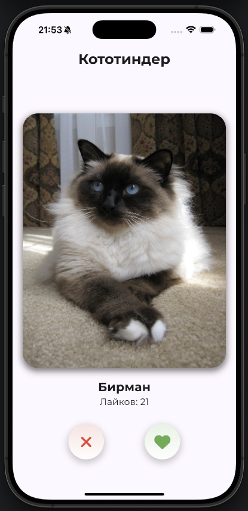

# Кототиндер

## Описание приложения
Приложение "Кототиндер" позволяет пользователям свайпать случайных котов, лайкать понравившихся и просматривать информацию о породе.

При запуске на главном экране появляется случайное изображение кота с его породой. Пользователь может:
- свайпнуть изображение влево или вправо, чтобы сменить кота,
- нажать на кнопку "лайк" или "дизлайк",
- открыть детальное описание, нажав на изображение кота.

Если кота лайкнули (свайпнули вправо) - увеличивается счетчик лайков. На экране с детальной информацией показывается то же изображение и полное описание породы.

## Реализованные фичи
- Получение случайного изображения кота с указанной породой из API https://thecatapi.com
- Предзагрузка списка котов, чтобы свайпы были без задержек
- Свайпы влево/вправо для смены кота
- Кнопки лайка и дизлайка
- Счетчик лайков
- Открытие экрана с детальным описанием кота
- Использование `Navigator` для переходов между экранами
- Кастомная иконка приложения

## Скриншоты



## Ссылка на скачивание APK
[Скачать актуальную версию](добавить apk)

## Установка и запуск
1. Склонировать репозиторий:
   ```sh
   git clone https://github.com/koto_tinder.git
2. Перейти в папку проекта:
   ```sh
   cd koto_tinder
3. Установить зависимости:
   ```sh
   flutter pub get
4. Запустить приложение:
   ```sh
   flutter run