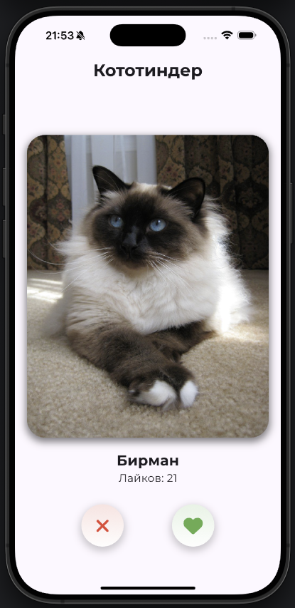
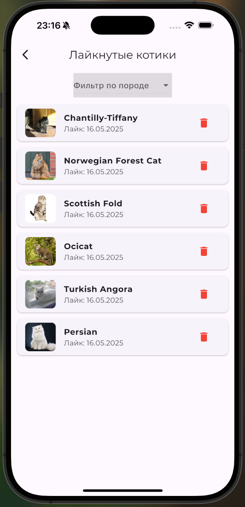

# Кототиндер

## Описание приложения
Приложение "Кототиндер" позволяет пользователям свайпать случайных котов, лайкать понравившихся, просматривать информацию о породе и сохранять любимых в отдельный экран "Избранное".

### Возможности:
- На главном экране отображается случайный кот с породой.
- Можно свайпать влево/вправо или использовать кнопки "лайк" и "дизлайк".
- Есть счётчик всех лайков.
- Детальный экран с информацией о породе, характеристиками, а также автоматическим переводом описания на русский язык.
- Экран "Избранное" — список всех лайкнутых котов за сессию.
- Удаление кота из избранного.
- Фильтр по породе на экране лайков.
- Переключение языка приложения (русский/английский). 
- Работает offline-режим: можно свайпать предзагруженных котов даже без интернета.
- При восстановлении интернета загрузка котов продолжается автоматически.

## Реализованные фичи
- Получение случайного изображения кота с указанной породой из API https://thecatapi.com
- Предзагрузка списка котов, чтобы свайпы были без задержек
- Анимация свайпов, а также анимация удаления из избранного
- Кнопки лайка и дизлайка
- Счетчик лайков
- Открытие экрана с детальным описанием кота
- Локализация (RU/EN)
- Переключатель языка на главном экране
- Экран избранного с возможностью удаления и фильтрации по породе
- Кастомная иконка приложения
- Автоматический перевод характеристик кота и породы на русский язык
- Offline-режим с сохранением картинок в кеше
- Автоматическая очистка кеша при запуске
- Разделение кода на слои Data, Domain, Presentation
- Unit-тесты на стейт-менеджеры с моками для API

## Скриншоты




## Ссылка на скачивание APK
[Скачать актуальную версию](https://github.com/gm116/koto_tinder/releases/download/v1.2.0/kototinder.apk)

## Установка и запуск
1. Склонировать репозиторий:
   ```sh
   git clone https://github.com/koto_tinder.git
2. Перейти в папку проекта:
   ```sh
   cd koto_tinder
3. Установить зависимости:
   ```sh
   flutter pub get
4. Запустить приложение:
   ```sh
   flutter run